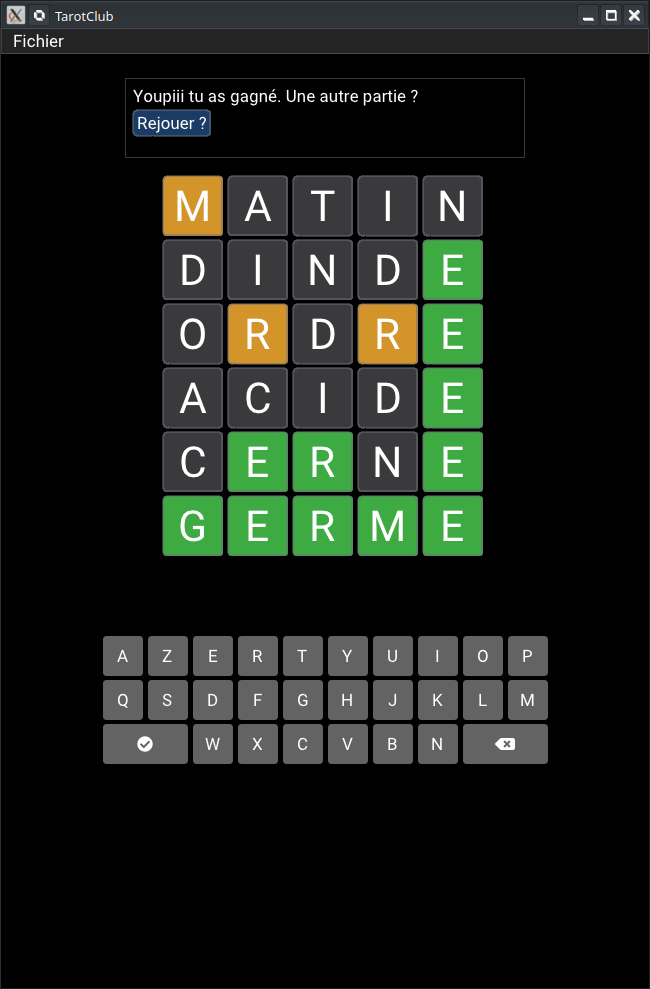

Galaxie de mots
================

Présentation
-------------

Collection de jeux de mots.

* Jeu 1 : Bouche cousue, inspiration Wordle / LeMot
* Jeu 2 : Topping, trouver des mots dans une pioche de 7 lettres

  
Comment je build pour Linux
------------------------------

Il faut :

* un compilateur C++
* CMake

Process :

1. mkdir build
2. cmake ..
3. make

Comment je build pour Android
------------------------------

À la racine :

- gradle assembleDebug ou assembleRelease selon la cible désirée ; n'effectue que la construction et la génération du paquet APK
- gradle installDebug ou installRelease : construit et installe sur la cible (vrai téléphone ou émulateur)
- gradlew bundle pour générer le fichier AAB

Comment je build pour mon autre OS propriétaire
------------------------------------------------

- Débrouille toi

Bases de données utilisées
--------------------------

* Dictionnaire Électronique des Mots — DEM par Jean Dubois et Françoise Dubois-Charlier (http://rali.iro.umontreal.ca/rali/?q=fr/versions-informatisees-lvf-dem)
* Le Lexique de Boris New & Christophe Pallier (http://www.lexique.org/)

License
--------

[CC BY SA40.0](LICENSE-CC-BY-SA4.0.txt)

